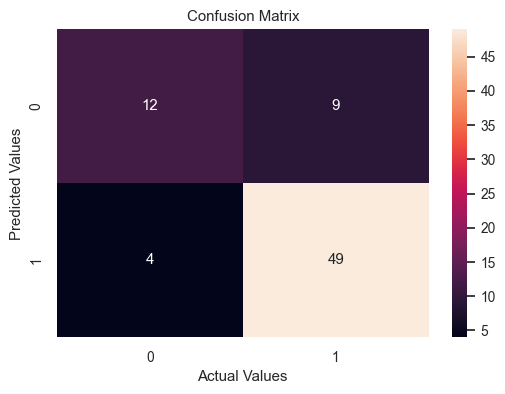
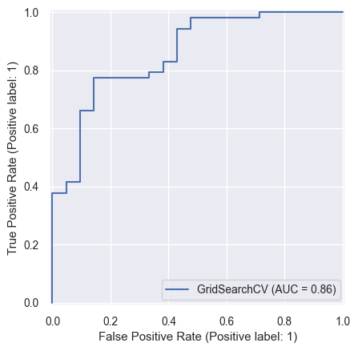
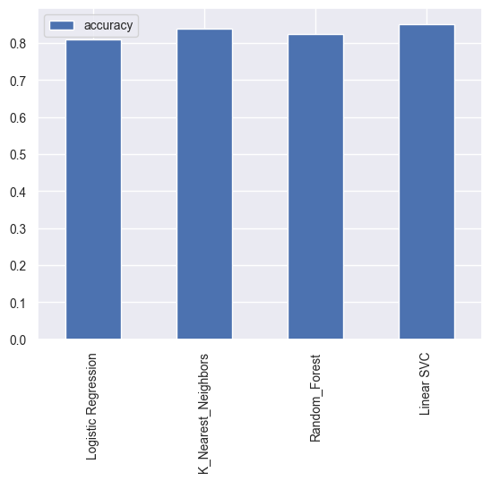
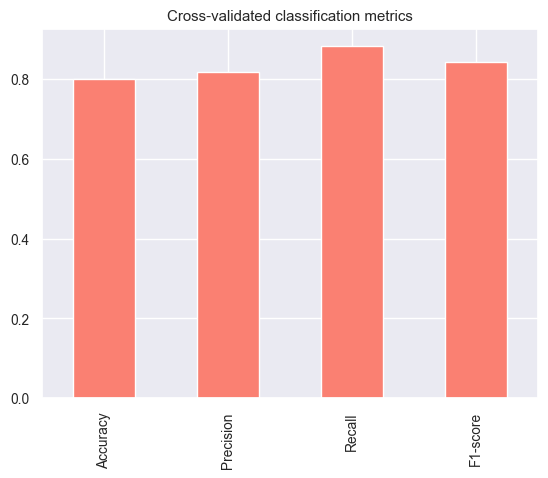
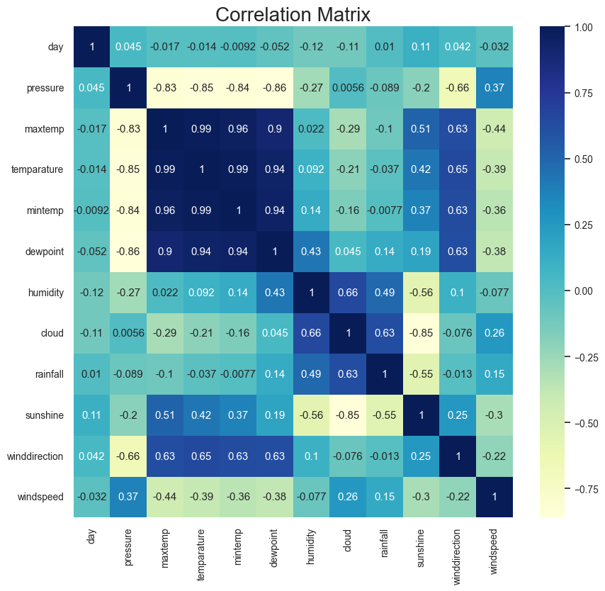
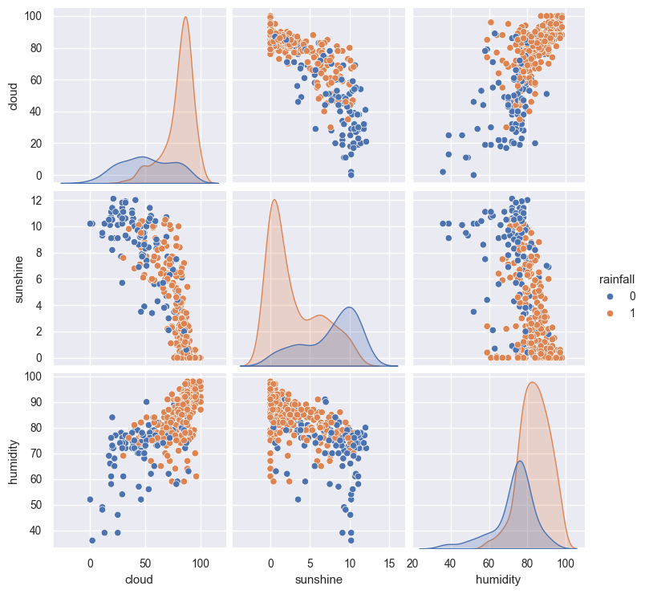
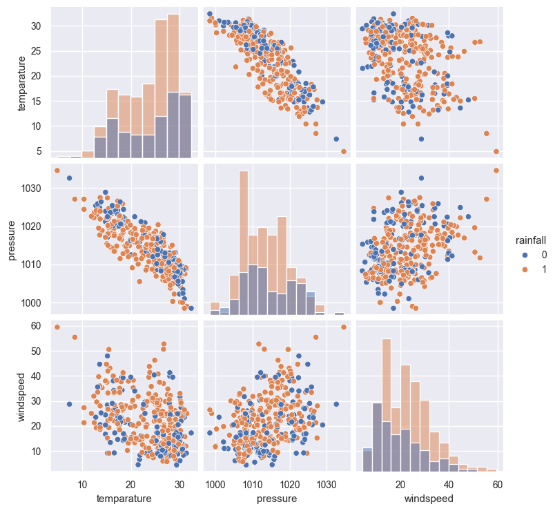
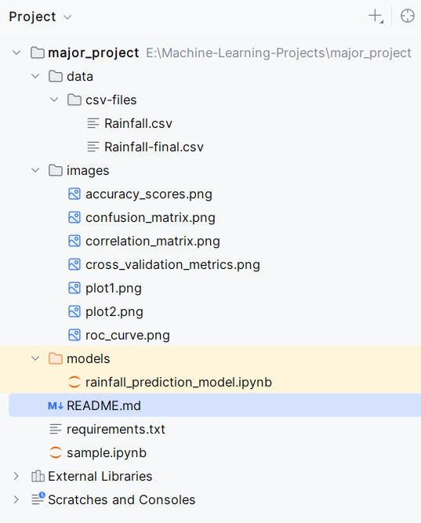

# 🌧️ Rainfall Prediction using Machine Learning

This project uses various meteorological features to build a binary classification model that predicts whether it will rain on a given day. The notebook is implemented in Python using libraries like `pandas`, `scikit-learn`, `XGBoost`, and `seaborn`.

---

## 📌 Objective
To classify each day as **rainy** or **non-rainy** using weather data (humidity, temperature, cloud cover, etc.).

---

## 📊 Dataset

- Source: [Rainfall Prediction Dataset – Kaggle](https://www.kaggle.com/datasets/amanpandit87/rainfall-prediction-dataset)
- Features include:
  - Pressure, Temperature, Dew Point, Humidity
  - Cloud Cover, Wind Speed & Direction, Sunshine Duration
  - Rainfall (Target)

---

## 🧠 Models Used

- Logistic Regression
- Random Forest Classifier
- K-Nearest Neighbors
- Support Vector Machine (LinearSVC)
- XGBoost Classifier

---

## ⚙️ Evaluation Metrics

- Accuracy
- Confusion Matrix
- Precision, Recall, F1-Score
- ROC-AUC




---

## 📈 Results

- **Best Model**: `RandomForesClassifier` with tuned hyperparameters
- **Accuracy Achieved**: *~83%* (can vary slightly based on seed/data split)
- Classification report and ROC curve show balanced performance on both classes.




---

## 🔍 Visualizations

The following visualizations were generated:

- Correlation Heatmap
- Distribution of features
- Confusion Matrix
- ROC Curve





---

## 📁 Project Structure



```bash
├── rainfall_prediction_model.ipynb  # Main notebook
├── README.md                        # Project documentation
└── images/                          # Output screenshots (plots, metrics)
```

---

## 🚀 How to Run

1. Clone this repository
2. Install dependencies:  
   `pip install -r requirements.txt`
3. Run the notebook in Jupyter or VS Code

---

## ✅ Requirements

- Python 3.7+
- pandas, numpy, matplotlib, seaborn
- scikit-learn, xgboost

---

## 📌 Author

--Ashish kumar
